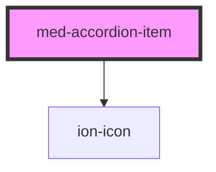

# accordion-item

<!-- Auto Generated Below -->

## Properties

| Property   | Attribute   | Description | Type                             | Default     |
| ---------- | ----------- | ----------- | -------------------------------- | ----------- |
| `icon`     | `icon`      |             | `"left" \| "right" \| undefined` | `undefined` |
| `noBorder` | `no-border` |             | `boolean`                        | `false`     |

## Events

| Event    | Description | Type               |
| -------- | ----------- | ------------------ |
| `toggle` |             | `CustomEvent<any>` |

## Dependencies

### Depends on

- ion-icon

### Graph

----------------------------------------------

*Built with [StencilJS](https://stenciljs.com/)*
