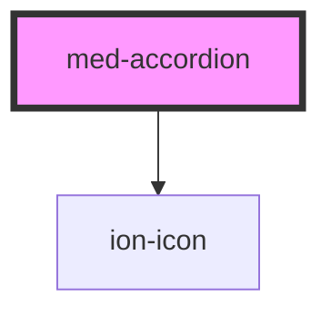

# med-accordion

<!-- Auto Generated Below -->

## Properties

| Property    | Attribute   | Description                                     | Type                             | Default     |
| ----------- | ----------- | ----------------------------------------------- | -------------------------------- | ----------- |
| `collapsed` | `collapsed` | Define o estado do componente.                  | `boolean`                        | `true`      |
| `icon`      | `icon`      | Define o posicionamento do icone do componente. | `"left" \| "right" \| undefined` | `undefined` |
| `size`      | `size`      | Define a variação de estilo do componente.      | `"full" \| undefined`            | `undefined` |

## Methods

### `toggle() => Promise<void>`

#### Returns

Type: `Promise<void>`

## Slots

| Slot             | Description                                         |
| ---------------- | --------------------------------------------------- |
| `"button"`       | Se houver algum botão deve ser colocado nesse slot. |
| `"content"`      | Conteúdo do componente.                             |
| `"content-fake"` | Conteúdo que vai aparecer com reticiências.         |
| `"header"`       | Define o conteudo do header.                        |

## Dependencies

### Depends on

- ion-icon

### Graph

----------------------------------------------

*Built with [StencilJS](https://stenciljs.com/)*
