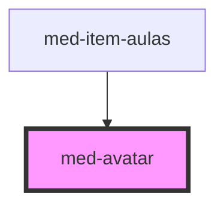

# med-avatar

<!-- Auto Generated Below -->

## Properties

| Property  | Attribute | Description                                 | Type                                                                            | Default     |
| --------- | --------- | ------------------------------------------- | ------------------------------------------------------------------------------- | ----------- |
| `color`   | `color`   | Define a cor neutra do componente.          | `string \| undefined`                                                           | `undefined` |
| `dsSize`  | `ds-size` | Define a variação de tamanho do componente. | `"base" \| "lg" \| "md" \| "sm" \| "xl" \| "xs" \| "xxl" \| "xxs" \| undefined` | `undefined` |
| `image`   | `image`   | Define a imagem do componente.              | `string \| undefined`                                                           | `undefined` |
| `letter`  | `letter`  | Define a imagem do componente.              | `string \| undefined`                                                           | `undefined` |
| `neutral` | `neutral` | Define a cor neutra do componente.          | `string \| undefined`                                                           | `undefined` |

## CSS Custom Properties

| Name           | Description                               |
| -------------- | ----------------------------------------- |
| `--background` | Define a cor de background do componente. |
| `--color`      | Define a cor do texto.                    |

## Dependencies

### Used by

 - [med-item-aulas](../med-item-aulas)

### Graph

----------------------------------------------

*Built with [StencilJS](https://stenciljs.com/)*
