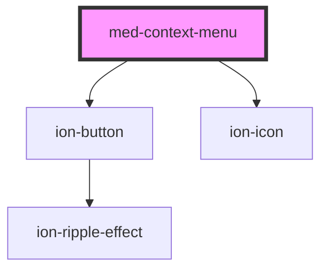

# med-context-menu

<!-- Auto Generated Below -->

## Properties

| Property  | Attribute | Description                        | Type                  | Default     |
| --------- | --------- | ---------------------------------- | --------------------- | ----------- |
| `color`   | `color`   | Define a cor do componente.        | `string \| undefined` | `undefined` |
| `neutral` | `neutral` | Define a cor neutra do componente. | `string \| undefined` | `undefined` |

## Dependencies

### Depends on

- [ion-button](../../../button)
- ion-icon

### Graph

----------------------------------------------

*Built with [StencilJS](https://stenciljs.com/)*
