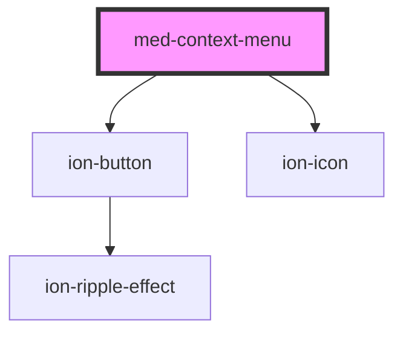

# med-context-menu

<!-- Auto Generated Below -->

## Dependencies

### Depends on

- [ion-button](../../../button)
- ion-icon

### Graph

----------------------------------------------

*Built with [StencilJS](https://stenciljs.com/)*
