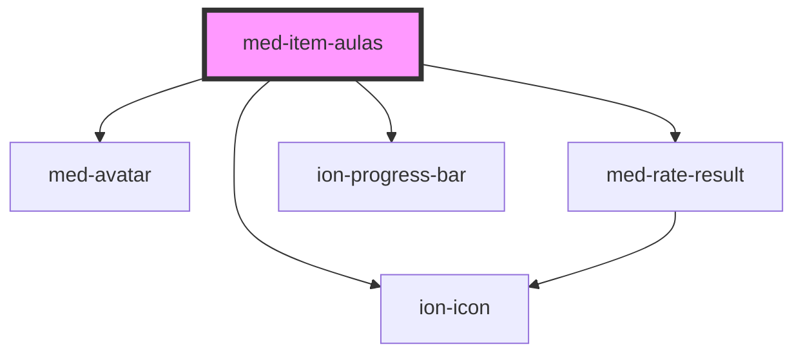

# med-item-aulas

<!-- Auto Generated Below -->

## Properties

| Property | Attribute | Description                      | Type                       | Default     |
| -------- | --------- | -------------------------------- | -------------------------- | ----------- |
| `dsName` | `ds-name` | Define a variação do componente. | `"secondary" \| undefined` | `undefined` |

## Dependencies

### Depends on

- [med-avatar](../med-avatar)
- [med-rate-result](../med-rate-result)
- ion-icon
- [ion-progress-bar](../../../progress-bar)

### Graph

----------------------------------------------

*Built with [StencilJS](https://stenciljs.com/)*
