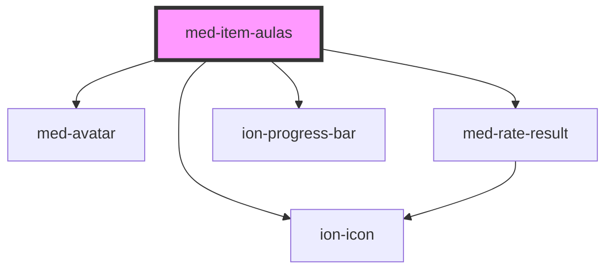

# med-item-aulas

<!-- Auto Generated Below -->

## CSS Custom Properties

| Name               | Description                         |
| ------------------ | ----------------------------------- |
| `--color-bom`      | Define a cor do icone de bom.       |
| `--color-excelent` | Define a cor do icone de excelente. |
| `--color-regular`  | Define a cor do icone de regular.   |
| `--color-ruim`     | Define a cor do icone de ruim.      |

## Dependencies

### Depends on

- [med-avatar](../med-avatar)
- [med-rate-result](../med-rate-result)
- ion-icon
- [ion-progress-bar](../../../progress-bar)

### Graph

----------------------------------------------

*Built with [StencilJS](https://stenciljs.com/)*
