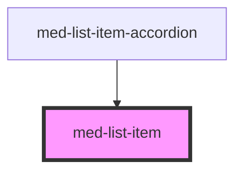

# med-list-item

<!-- Auto Generated Below -->

## Properties

| Property   | Attribute  | Description | Type                                | Default     |
| ---------- | ---------- | ----------- | ----------------------------------- | ----------- |
| `border`   | `border`   |             | `boolean`                           | `false`     |
| `color`    | `color`    |             | `string \| undefined`               | `undefined` |
| `dsSize`   | `ds-size`  |             | `"md" \| "sm" \| "xs" \| undefined` | `undefined` |
| `label`    | `label`    |             | `string \| undefined`               | `undefined` |
| `neutral`  | `neutral`  |             | `string \| undefined`               | `undefined` |
| `selected` | `selected` |             | `boolean`                           | `false`     |
| `titulo`   | `titulo`   |             | `string \| undefined`               | `undefined` |

## Dependencies

### Used by

 - [med-list-item-accordion](../med-list-item-accordion)

### Graph

----------------------------------------------

*Built with [StencilJS](https://stenciljs.com/)*
