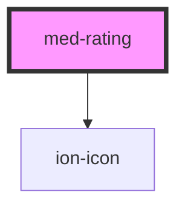

# med-rating

<!-- Auto Generated Below -->

## Properties

| Property   | Attribute  | Description                               | Type                                 | Default     |
| ---------- | ---------- | ----------------------------------------- | ------------------------------------ | ----------- |
| `cabe`     | `cabe`     | Define o conteúdo de texto do componente. | `boolean`                            | `true`      |
| `concurso` | `concurso` |                                           | `string \| undefined`                | `undefined` |
| `date`     | `date`     |                                           | `string \| undefined`                | `undefined` |
| `dsName`   | `ds-name`  | Define a variação do componente.          | `"banca" \| "medgrupo" \| undefined` | `undefined` |
| `name`     | `name`     | Define o conteúdo de texto do componente. | `string \| undefined`                | `undefined` |
| `texto`    | `texto`    |                                           | `string \| undefined`                | `undefined` |

## CSS Custom Properties

| Name           | Description                               |
| -------------- | ----------------------------------------- |
| `--background` | Define a cor de background do componente. |
| `--color`      | Define a cor do componente.               |

## Dependencies

### Depends on

- ion-icon

### Graph

----------------------------------------------

*Built with [StencilJS](https://stenciljs.com/)*
