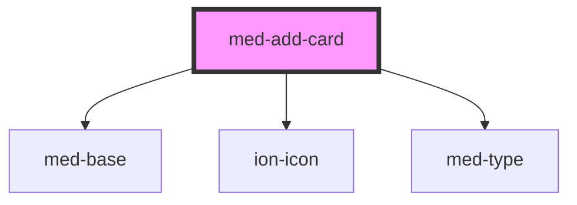

# med-add-card

<!-- Auto Generated Below -->

## Properties

| Property   | Attribute   | Description      | Type                  | Default     |
| ---------- | ----------- | ---------------- | --------------------- | ----------- |
| `iconName` | `icon-name` | Define o icone.  | `string \| undefined` | `undefined` |
| `titulo`   | `titulo`    | Define o titulo. | `string \| undefined` | `undefined` |

## Dependencies

### Depends on

- [med-base](../../core/med-base)
- ion-icon
- [med-type](../../foundation/med-type)

### Graph

----------------------------------------------

*Built with [StencilJS](https://stenciljs.com/)*
