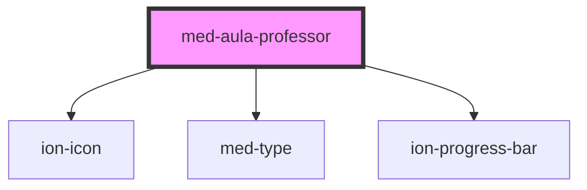

# med-aula-professor

<!-- Auto Generated Below -->

## Properties

| Property                   | Attribute     | Description                 | Type                  | Default     |
| -------------------------- | ------------- | --------------------------- | --------------------- | ----------- |
| `active`                   | `active`      | TO DO                       | `boolean`             | `false`     |
| `dsColor`                  | `ds-color`    | Define a cor do componente. | `string \| undefined` | `undefined` |
| `icon` _(required)_        | `icon`        | TO DO                       | `string`              | `undefined` |
| `professores` _(required)_ | `professores` | TO DO                       | `string`              | `undefined` |
| `titulo` _(required)_      | `titulo`      | TO DO                       | `string`              | `undefined` |
| `value` _(required)_       | `value`       | TO DO                       | `number`              | `undefined` |
| `videos` _(required)_      | `videos`      | TO DO                       | `string`              | `undefined` |

## Dependencies

### Depends on

- ion-icon
- [med-type](../../core/med-type)
- [ion-progress-bar](../../../progress-bar)

### Graph

----------------------------------------------

*Built with [StencilJS](https://stenciljs.com/)*
