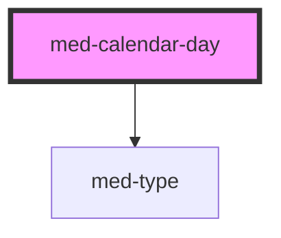

# med-calendar-day

<!-- Auto Generated Below -->

## Properties

| Property  | Attribute  | Description                 | Type                     | Default     |
| --------- | ---------- | --------------------------- | ------------------------ | ----------- |
| `active`  | `active`   |                             | `boolean`                | `false`     |
| `dsColor` | `ds-color` | Define a cor do componente. | `string \| undefined`    | `undefined` |
| `fill`    | `fill`     |                             | `"outline" \| undefined` | `undefined` |

## Dependencies

### Depends on

- [med-type](../../foundation/med-type)

### Graph

----------------------------------------------

*Built with [StencilJS](https://stenciljs.com/)*
