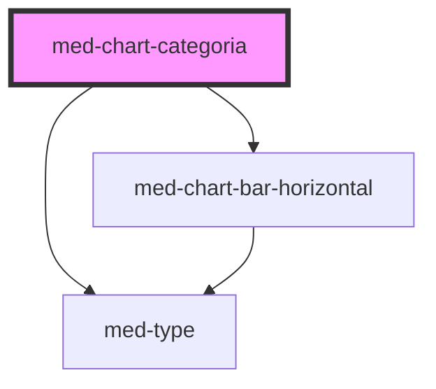

# med-chart-categoria

<!-- Auto Generated Below -->

## Properties

| Property    | Attribute   | Description                   | Type                  | Default     |
| ----------- | ----------- | ----------------------------- | --------------------- | ----------- |
| `dsColor`   | `ds-color`  | Define a cor do componente.   | `string \| undefined` | `undefined` |
| `meta`      | `meta`      |                               | `string \| undefined` | `undefined` |
| `realizado` | `realizado` |                               | `string \| undefined` | `undefined` |
| `titulo`    | `titulo`    |                               | `string \| undefined` | `undefined` |
| `value`     | `value`     | Define o valor do componente. | `number`              | `0`         |

## Dependencies

### Depends on

- [med-type](../../core/med-type)
- [med-chart-bar-horizontal](../../core/med-chart-bar-horizontal)

### Graph

----------------------------------------------

*Built with [StencilJS](https://stenciljs.com/)*
