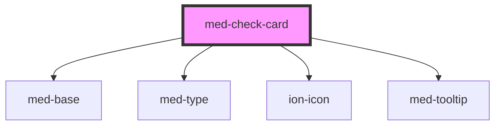

# med-check-card

<!-- Auto Generated Below -->

## Properties

| Property           | Attribute           | Description                 | Type                                                  | Default     |
| ------------------ | ------------------- | --------------------------- | ----------------------------------------------------- | ----------- |
| `alert`            | `alert`             |                             | `boolean`                                             | `false`     |
| `categoria`        | `categoria`         |                             | `string \| undefined`                                 | `undefined` |
| `dsColor`          | `ds-color`          | Define a cor do componente. | `string \| undefined`                                 | `undefined` |
| `finalizada`       | `finalizada`        |                             | `string \| undefined`                                 | `undefined` |
| `horaFinal`        | `hora-final`        |                             | `string \| undefined`                                 | `undefined` |
| `horaInicial`      | `hora-inicial`      |                             | `string \| undefined`                                 | `undefined` |
| `iconName`         | `icon-name`         |                             | `string \| undefined`                                 | `undefined` |
| `titulo`           | `titulo`            |                             | `string \| undefined`                                 | `undefined` |
| `tooltipCollapsed` | `tooltip-collapsed` |                             | `boolean`                                             | `true`      |
| `tooltipContent`   | `tooltip-content`   |                             | `string \| undefined`                                 | `undefined` |
| `tooltipHeading`   | `tooltip-heading`   |                             | `string \| undefined`                                 | `undefined` |
| `tooltipPlacement` | `tooltip-placement` |                             | `"bottom" \| "left" \| "right" \| "top" \| undefined` | `'top'`     |

## Dependencies

### Depends on

- [med-base](../../core/med-base)
- [med-type](../../core/med-type)
- ion-icon
- [med-tooltip](../../global/med-tooltip)

### Graph

----------------------------------------------

*Built with [StencilJS](https://stenciljs.com/)*
