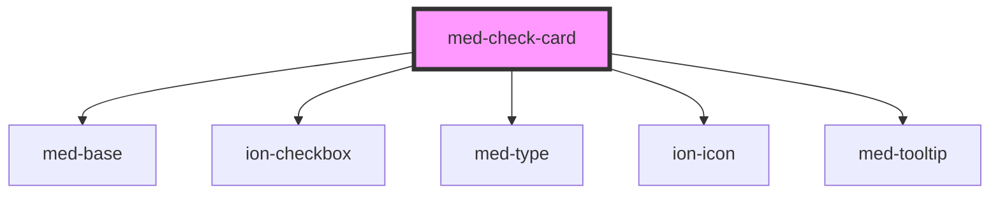

# med-check-card

<!-- Auto Generated Below -->

## Properties

| Property  | Attribute  | Description                 | Type                  | Default     |
| --------- | ---------- | --------------------------- | --------------------- | ----------- |
| `alert`   | `alert`    |                             | `boolean`             | `false`     |
| `dsColor` | `ds-color` | Define a cor do componente. | `string \| undefined` | `undefined` |

## Dependencies

### Depends on

- [med-base](../../core/med-base)
- [ion-checkbox](../../../checkbox)
- [med-type](../../core/med-type)
- ion-icon
- [med-tooltip](../../global/med-tooltip)

### Graph

----------------------------------------------

*Built with [StencilJS](https://stenciljs.com/)*
