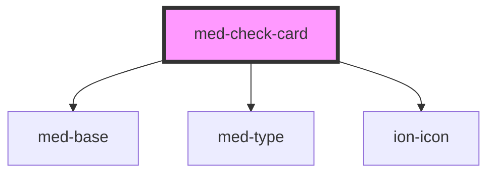

# med-check-card

<!-- Auto Generated Below -->

## Properties

| Property      | Attribute      | Description                      | Type                  | Default     |
| ------------- | -------------- | -------------------------------- | --------------------- | ----------- |
| `alert`       | `alert`        | Define o estado.                 | `boolean`             | `false`     |
| `categoria`   | `categoria`    | Define a categoria.              | `string \| undefined` | `undefined` |
| `dataFinal`   | `data-final`   | Define a data de termino.        | `string \| undefined` | `undefined` |
| `dataInicial` | `data-inicial` | Define a data de inicio.         | `string \| undefined` | `undefined` |
| `dsColor`     | `ds-color`     | Define a cor.                    | `string \| undefined` | `undefined` |
| `finalizada`  | `finalizada`   | Define se a task foi finalizada. | `string \| undefined` | `undefined` |
| `horaFinal`   | `hora-final`   | Define a hora de termino.        | `string \| undefined` | `undefined` |
| `horaInicial` | `hora-inicial` | Define a hora de inicio.         | `string \| undefined` | `undefined` |
| `iconName`    | `icon-name`    | Define o icone.                  | `string \| undefined` | `undefined` |
| `titulo`      | `titulo`       | Define o titulo.                 | `string \| undefined` | `undefined` |

## Events

| Event             | Description | Type               |
| ----------------- | ----------- | ------------------ |
| `medClick`        |             | `CustomEvent<any>` |
| `medTooltipClose` |             | `CustomEvent<any>` |

## Dependencies

### Depends on

- [med-base](../../core/med-base)
- [med-type](../../foundation/med-type)
- ion-icon

### Graph

----------------------------------------------

*Built with [StencilJS](https://stenciljs.com/)*
