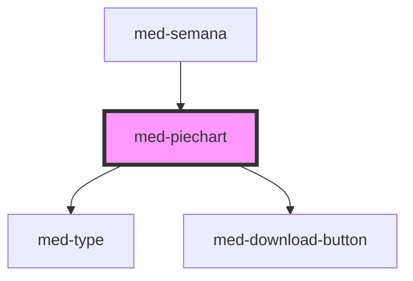

# med-piechart

<!-- Auto Generated Below -->

## Properties

| Property           | Attribute           | Description                                            | Type                  | Default     |
| ------------------ | ------------------- | ------------------------------------------------------ | --------------------- | ----------- |
| `download`         | `download`          | Define o estado de download do componente.             | `boolean`             | `false`     |
| `downloadProgress` | `download-progress` | Define o valor do progresso do componente de download. | `number`              | `0`         |
| `downloaded`       | `downloaded`        | Define o estado de downloaded do componente.           | `boolean`             | `false`     |
| `dsColor`          | `ds-color`          | Define a cor do componente.                            | `string \| undefined` | `undefined` |
| `dsSize`           | `ds-size`           | Define a variação de tamanho do componente.            | `"sm" \| undefined`   | `undefined` |
| `label`            | `label`             | Define a porcentagem a ser mostrada.                   | `string \| undefined` | `undefined` |
| `value`            | `value`             | Define o valor do progresso do componente do piechart. | `number`              | `0`         |

## Methods

### `toggle(event?: Event | undefined) => Promise<void>`

Define o estado do componente programaticamente.

#### Returns

Type: `Promise<void>`

## Dependencies

### Used by

 - [med-semana](../med-semana)

### Depends on

- [med-type](../../core/med-type)
- [med-download-button](../../core/med-download-button)

### Graph

----------------------------------------------

*Built with [StencilJS](https://stenciljs.com/)*
