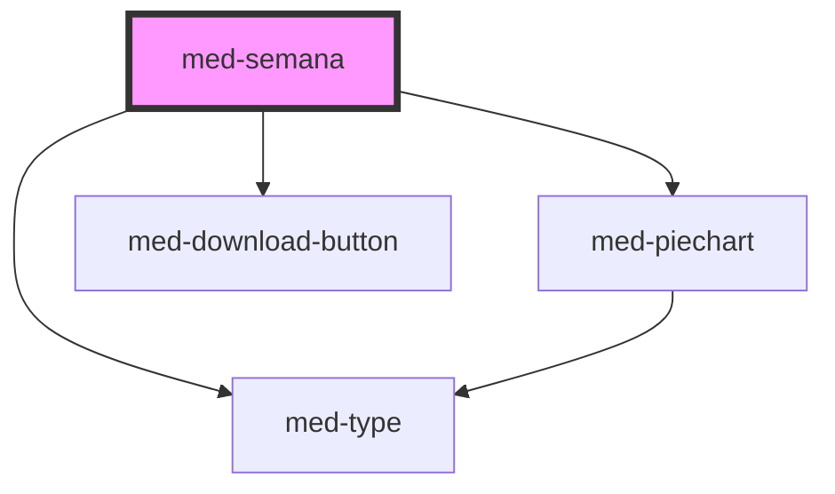

# med-semana

<!-- Auto Generated Below -->

## Properties

| Property  | Attribute  | Description                    | Type                   | Default     |
| --------- | ---------- | ------------------------------ | ---------------------- | ----------- |
| `active`  | `active`   | Define o estado do componente. | `boolean`              | `false`     |
| `dsColor` | `ds-color` | Define a cor do componente.    | `string \| undefined`  | `undefined` |
| `skin`    | `skin`     | Define a skin do componente.   | `"lista" \| undefined` | `undefined` |

## Dependencies

### Depends on

- [med-type](../../core/med-type)
- [med-piechart](../../core/med-piechart)
- [med-download-button](../../global/med-download-button)

### Graph

----------------------------------------------

*Built with [StencilJS](https://stenciljs.com/)*
