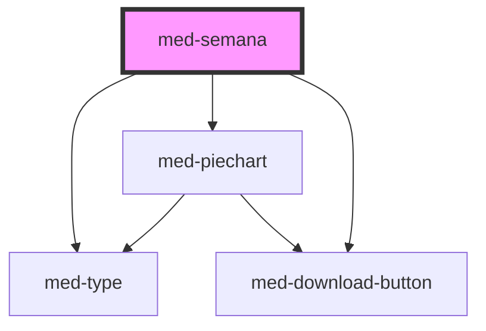

# med-semana

<!-- Auto Generated Below -->

## Properties

| Property               | Attribute  | Description                                 | Type                   | Default     |
| ---------------------- | ---------- | ------------------------------------------- | ---------------------- | ----------- |
| `active`               | `active`   | Define o estado active do componente.       | `boolean`              | `false`     |
| `content` _(required)_ | --         | Define o conteudo da semana.                | `MedSemanaInterface`   | `undefined` |
| `dsColor`              | `ds-color` | Define a cor do componente.                 | `string \| undefined`  | `undefined` |
| `dsSize`               | `ds-size`  | Define a variação de tamanho do componente. | `"sm" \| undefined`    | `undefined` |
| `skin`                 | `skin`     | Define a skin do componente.                | `"lista" \| undefined` | `undefined` |

## Dependencies

### Depends on

- [med-type](../../core/med-type)
- [med-piechart](../med-piechart)
- [med-download-button](../../core/med-download-button)

### Graph

----------------------------------------------

*Built with [StencilJS](https://stenciljs.com/)*
