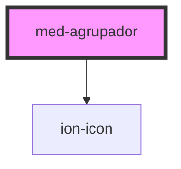

# med-agrupador

<!-- Auto Generated Below -->

## Properties

| Property           | Attribute           | Description                       | Type                  | Default              |
| ------------------ | ------------------- | --------------------------------- | --------------------- | -------------------- |
| `collapsed`        | `collapsed`         | Define o estado do componente.    | `boolean`             | `false`              |
| `dsColor`          | `ds-color`          | Define a cor do componente.       | `string \| undefined` | `undefined`          |
| `labelAlternativo` | `label-alternativo` | Define o texto no estado active.  | `string`              | `'Ocultar a lista'`  |
| `labelDefault`     | `label-default`     | Define o texto no estado default. | `string`              | `'Expandir a lista'` |

## Methods

### `toggle(event?: Event | undefined) => Promise<void>`

Define o estado do componente programaticamente.

#### Returns

Type: `Promise<void>`

## Dependencies

### Depends on

- ion-icon

### Graph

----------------------------------------------

*Built with [StencilJS](https://stenciljs.com/)*
