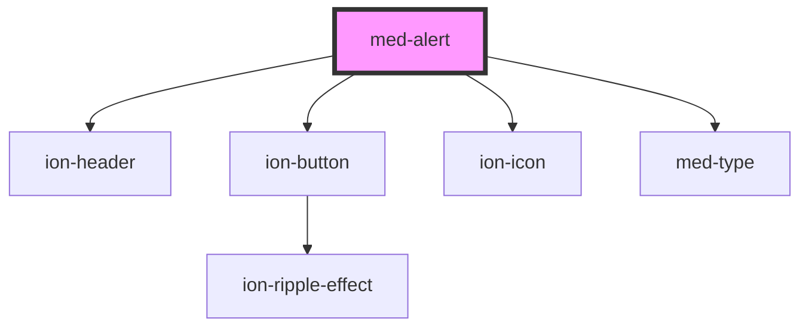

# med-alert

<!-- Auto Generated Below -->

## Properties

| Property      | Attribute      | Description | Type                  | Default     |
| ------------- | -------------- | ----------- | --------------------- | ----------- |
| `cancelText`  | `cancel-text`  |             | `string \| undefined` | `undefined` |
| `confirmText` | `confirm-text` |             | `string \| undefined` | `undefined` |
| `heading`     | `heading`      |             | `string \| undefined` | `undefined` |
| `message`     | `message`      |             | `string \| undefined` | `undefined` |

## Dependencies

### Depends on

- [ion-header](../../../header)
- [ion-button](../../../button)
- ion-icon
- [med-type](../../../@templarios/core/med-type)

### Graph

----------------------------------------------

*Built with [StencilJS](https://stenciljs.com/)*
