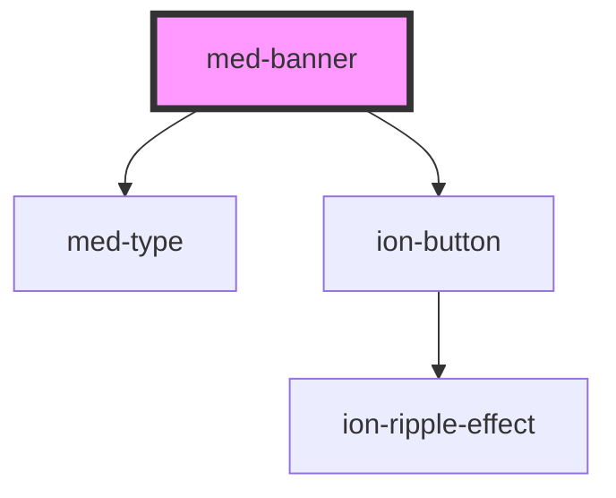

# med-banner

<!-- Auto Generated Below -->

## Properties

| Property                | Attribute   | Description                                   | Type                        | Default     |
| ----------------------- | ----------- | --------------------------------------------- | --------------------------- | ----------- |
| `btnLeft` _(required)_  | `btn-left`  | Define o texto do botão esquerdo, se existir. | `string`                    | `undefined` |
| `btnRight` _(required)_ | `btn-right` | Define o texto do botão direito, se existir.  | `string`                    | `undefined` |
| `dsColor`               | `ds-color`  | Define a cor do componente.                   | `string \| undefined`       | `undefined` |
| `dsSize`                | `ds-size`   | Define a variação de tamanho do componente.   | `"md" \| "sm" \| undefined` | `'sm'`      |
| `texto`                 | `texto`     | Define o texto do componente.                 | `string \| undefined`       | `undefined` |
| `titulo`                | `titulo`    | Define o título do componente.                | `string \| undefined`       | `undefined` |

## Events

| Event           | Description                                   | Type                |
| --------------- | --------------------------------------------- | ------------------- |
| `btnLeftClick`  | Emitido quando há um click no botão esquerdo. | `CustomEvent<void>` |
| `btnRightClick` | Emitido quando há um click no botão direito.  | `CustomEvent<void>` |

## Dependencies

### Depends on

- [med-type](../med-type)
- [ion-button](../../../button)

### Graph

----------------------------------------------

*Built with [StencilJS](https://stenciljs.com/)*
