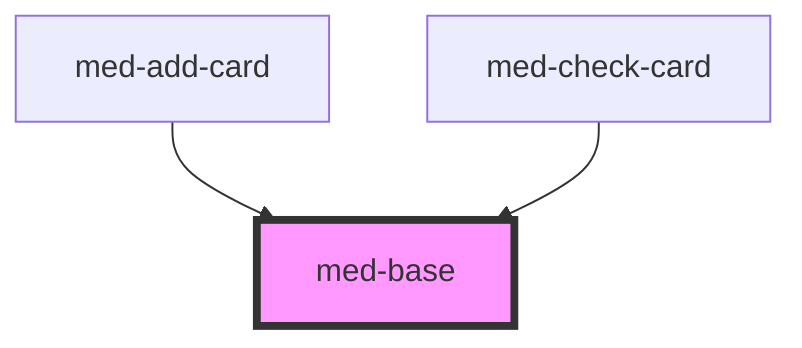

# med-base

<!-- Auto Generated Below -->

## Properties

| Property   | Attribute   | Description                                            | Type                  | Default     |
| ---------- | ----------- | ------------------------------------------------------ | --------------------- | ----------- |
| `dsColor`  | `ds-color`  | Define a cor do componente.                            | `string \| undefined` | `undefined` |
| `gap`      | `gap`       | Define o gap entre slots.                              | `string \| undefined` | `undefined` |
| `radius`   | `radius`    | Define a variação de borde-radius do componente.       | `string \| undefined` | `undefined` |
| `spacingH` | `spacing-h` | Define a variação de padding horizontal do componente. | `string \| undefined` | `undefined` |
| `spacingV` | `spacing-v` | Define a variação de padding vertical do componente.   | `string \| undefined` | `undefined` |

## Slots

| Slot       | Description                                      |
| ---------- | ------------------------------------------------ |
|            | Slot default.                                    |
| `"end"`    | Conteúdo é posicionado a direita do componente.  |
| `"middle"` | Conteúdo é posicionado ao centro do componente.  |
| `"start"`  | Conteúdo é posicionado a esquerda do componente. |

## Dependencies

### Used by

 - [med-add-card](../../compositions/med-add-card)
 - [med-check-card](../../compositions/med-check-card)

### Graph

----------------------------------------------

*Built with [StencilJS](https://stenciljs.com/)*
