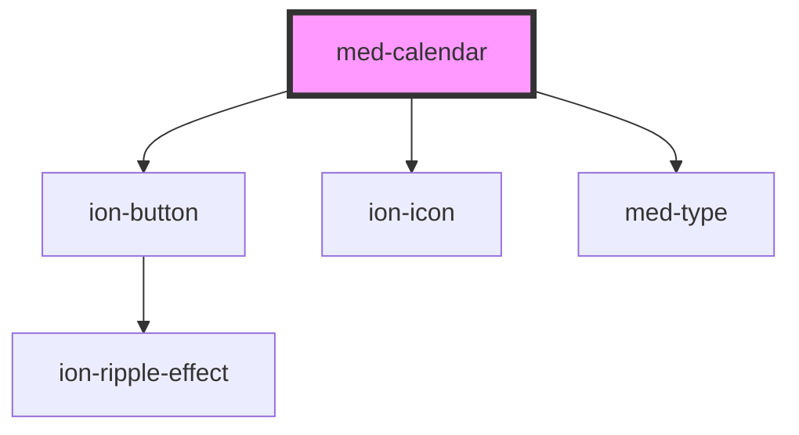

# med-calendar

<!-- Auto Generated Below -->

## Properties

| Property     | Attribute    | Description                 | Type                  | Default     |
| ------------ | ------------ | --------------------------- | --------------------- | ----------- |
| `calendario` | `calendario` |                             | `string \| undefined` | `undefined` |
| `dsColor`    | `ds-color`   | Define a cor do componente. | `string \| undefined` | `undefined` |

## Events

| Event            | Description | Type               |
| ---------------- | ----------- | ------------------ |
| `medChoiceClick` |             | `CustomEvent<any>` |
| `medMonthClick`  |             | `CustomEvent<any>` |

## Dependencies

### Depends on

- [ion-button](../../../button)
- ion-icon
- [med-type](../med-type)

### Graph

----------------------------------------------

*Built with [StencilJS](https://stenciljs.com/)*
