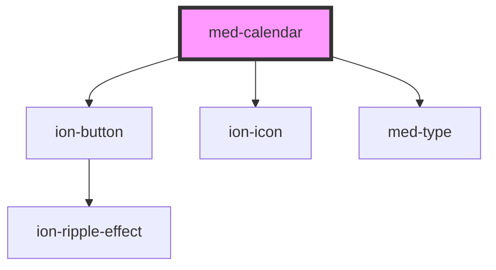

# med-calendar

<!-- Auto Generated Below -->

## Properties

| Property  | Attribute  | Description | Type                  | Default     |
| --------- | ---------- | ----------- | --------------------- | ----------- |
| `ano`     | `ano`      |             | `string \| undefined` | `undefined` |
| `dsColor` | `ds-color` |             | `string \| undefined` | `undefined` |
| `mes`     | `mes`      |             | `string \| undefined` | `undefined` |

## Events

| Event      | Description | Type               |
| ---------- | ----------- | ------------------ |
| `medClick` |             | `CustomEvent<any>` |
| `medSwipe` |             | `CustomEvent<any>` |

## Dependencies

### Depends on

- [ion-button](../../../button)
- ion-icon
- [med-type](../med-type)

### Graph

----------------------------------------------

*Built with [StencilJS](https://stenciljs.com/)*
