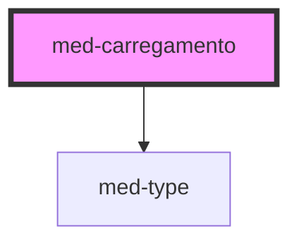

# med-carregamento

<!-- Auto Generated Below -->

## Properties

| Property               | Attribute | Description | Type     | Default     |
| ---------------------- | --------- | ----------- | -------- | ----------- |
| `color`                | `color`   |             | `string` | `'#808080'` |
| `message` _(required)_ | `message` |             | `string` | `undefined` |

## Dependencies

### Depends on

- [med-type](../../foundation/med-type)

### Graph

----------------------------------------------

*Built with [StencilJS](https://stenciljs.com/)*
