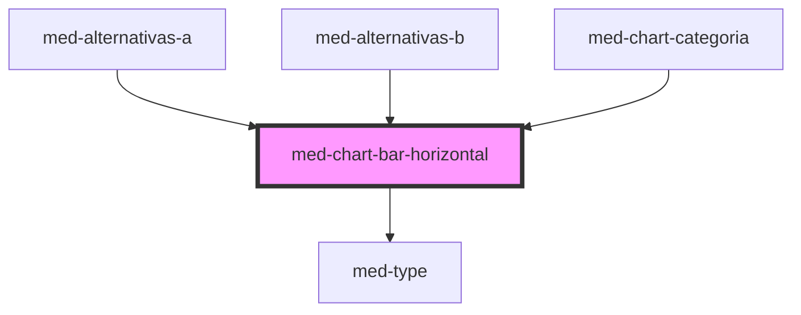

# chart-bar-horizontal

<!-- Auto Generated Below -->

## Properties

| Property  | Attribute  | Description                                 | Type                  | Default     |
| --------- | ---------- | ------------------------------------------- | --------------------- | ----------- |
| `dsColor` | `ds-color` | Define a cor do componente.                 | `string \| undefined` | `undefined` |
| `dsSize`  | `ds-size`  | Define a variação de tamanho do componente. | `"md" \| undefined`   | `undefined` |
| `label`   | `label`    | Define a visibilidade do label.             | `boolean`             | `true`      |
| `unidade` | `unidade`  | Define o valor do componente.               | `string`              | `'%'`       |
| `value`   | `value`    | Define o valor do componente.               | `number`              | `0`         |

## Shadow Parts

| Part         | Description |
| ------------ | ----------- |
| `"progress"` |             |
| `"track"`    |             |

## Dependencies

### Used by

 - [med-alternativas-a](../../team/questoes/med-alternativas-a)
 - [med-alternativas-b](../../team/questoes/med-alternativas-b)
 - [med-chart-categoria](../../compositions/med-chart-categoria)

### Depends on

- [med-type](../../foundation/med-type)

### Graph

----------------------------------------------

*Built with [StencilJS](https://stenciljs.com/)*
