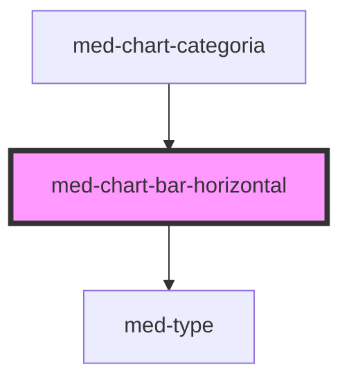

# chart-bar-horizontal

<!-- Auto Generated Below -->

## Properties

| Property  | Attribute  | Description                   | Type                  | Default     |
| --------- | ---------- | ----------------------------- | --------------------- | ----------- |
| `dsColor` | `ds-color` | Define a cor do componente.   | `string \| undefined` | `undefined` |
| `value`   | `value`    | Define o valor do componente. | `number`              | `0`         |

## Shadow Parts

| Part         | Description |
| ------------ | ----------- |
| `"progress"` |             |
| `"track"`    |             |

## Dependencies

### Used by

 - [med-chart-categoria](../../compositions/med-chart-categoria)

### Depends on

- [med-type](../med-type)

### Graph

----------------------------------------------

*Built with [StencilJS](https://stenciljs.com/)*
