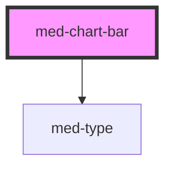

# med-chart-bar

<!-- Auto Generated Below -->

## Properties

| Property  | Attribute  | Description                            | Type                  | Default     |
| --------- | ---------- | -------------------------------------- | --------------------- | ----------- |
| `dsColor` | `ds-color` | Define a cor do componente.            | `string \| undefined` | `undefined` |
| `height`  | `height`   | Define o height em px do componente.   | `number`              | `50`        |
| `token`   | `token`    | Define o token do label do componente. | `string`              | `'p12b'`    |
| `value`   | `value`    | Define a valor do componente.          | `number`              | `0`         |
| `width`   | `width`    | Define o width em px do componente.    | `number`              | `42`        |

## Dependencies

### Depends on

- [med-type](../med-type)

### Graph

----------------------------------------------

*Built with [StencilJS](https://stenciljs.com/)*
