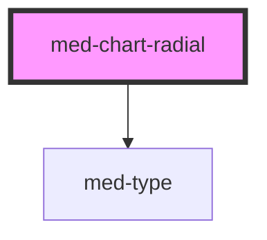

# med-chart-radial

<!-- Auto Generated Below -->

## Properties

| Property    | Attribute   | Description                   | Type                                        | Default     |
| ----------- | ----------- | ----------------------------- | ------------------------------------------- | ----------- |
| `dsColor`   | `ds-color`  | Define a cor do componente.   | `string \| undefined`                       | `undefined` |
| `dsSize`    | `ds-size`   | Define a variação de tamanho. | `"lg" \| "md" \| "sm" \| "xs" \| undefined` | `undefined` |
| `subtitulo` | `subtitulo` | Define o texto secundario.    | `string \| undefined`                       | `undefined` |
| `titulo`    | `titulo`    | Define o texto primario.      | `string \| undefined`                       | `undefined` |
| `valores`   | --          | Define os valores do gráfico  | `MedChartRadiaItem[]`                       | `[]`        |

## Dependencies

### Depends on

- [med-type](../med-type)

### Graph

----------------------------------------------

*Built with [StencilJS](https://stenciljs.com/)*
