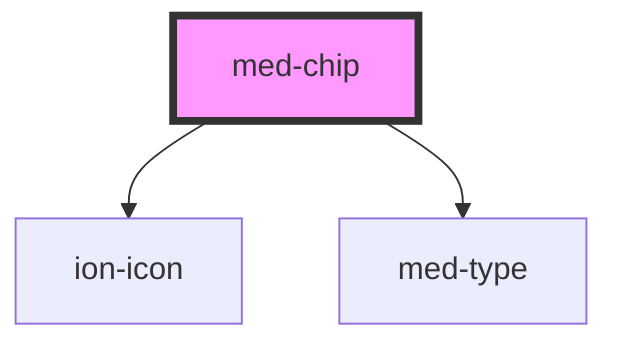

# ion-chip

Chips represent complex entities in small blocks, such as a contact. A chip can contain several different elements such as avatars, text, and icons.

<!-- Auto Generated Below -->

## Properties

| Property                 | Attribute    | Description                              | Type                       | Default     |
| ------------------------ | ------------ | ---------------------------------------- | -------------------------- | ----------- |
| `active`                 | `active`     | Define o estado active do componente.    | `boolean`                  | `false`     |
| `disabled`               | `disabled`   | Define o estado disabled do componente.  | `boolean`                  | `false`     |
| `dsColor`                | `ds-color`   | Define a cor do componente.              | `string \| undefined`      | `undefined` |
| `dsName`                 | `ds-name`    | Define a variação do componente.         | `"secondary" \| undefined` | `undefined` |
| `dsSize`                 | `ds-size`    | Define a variação de tamanho componente. | `"md" \| undefined`        | `undefined` |
| `iconLeft` _(required)_  | `icon-left`  | Define o icone left do componente.       | `string`                   | `undefined` |
| `iconRight` _(required)_ | `icon-right` | Define o icone right do componente.      | `string`                   | `undefined` |
| `label` _(required)_     | `label`      | Define o texto do componente.            | `string`                   | `undefined` |

## Events

| Event      | Description                          | Type                |
| ---------- | ------------------------------------ | ------------------- |
| `medBlur`  | Emitido quando o chip perde o focus. | `CustomEvent<void>` |
| `medClick` | Emitido quando o chip é clicado.     | `CustomEvent<void>` |
| `medFocus` | Emitido quando o chip tem focus.     | `CustomEvent<void>` |

## Dependencies

### Depends on

- ion-icon
- [med-type](../med-type)

### Graph

----------------------------------------------

*Built with [StencilJS](https://stenciljs.com/)*
