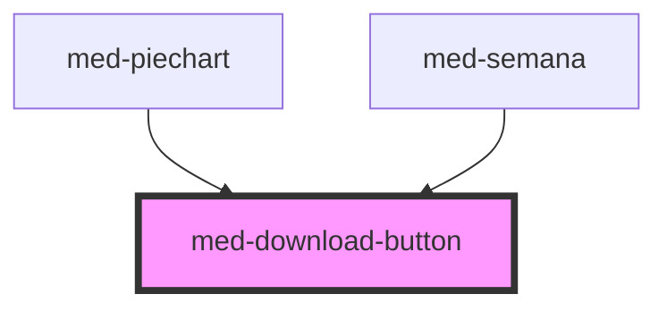

# med-download-button

<!-- Auto Generated Below -->

## Properties

| Property      | Attribute     | Description                                                    | Type                  | Default     |
| ------------- | ------------- | -------------------------------------------------------------- | --------------------- | ----------- |
| `downloaded`  | `downloaded`  | Define o estado do componente quando download tiver concluído. | `boolean`             | `false`     |
| `downloading` | `downloading` | Define o estado do componente durante o download.              | `boolean`             | `false`     |
| `dsColor`     | `ds-color`    | Define a cor do componente.                                    | `string \| undefined` | `undefined` |
| `initial`     | `initial`     | Define o estado inicial do componente.                         | `boolean`             | `true`      |
| `value`       | `value`       | Define o valor da progress bar do componente.                  | `number`              | `0`         |

## Events

| Event           | Description                             | Type               |
| --------------- | --------------------------------------- | ------------------ |
| `medCancelar`   | Emitido quando download for cancelado.  | `CustomEvent<any>` |
| `medDownloaded` | Emitido quando download está concluído. | `CustomEvent<any>` |

## Dependencies

### Used by

 - [med-piechart](../../compositions/med-piechart)
 - [med-semana](../../compositions/med-semana)

### Graph

----------------------------------------------

*Built with [StencilJS](https://stenciljs.com/)*
