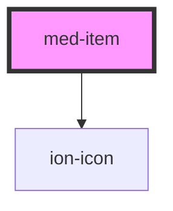

# med-item

<!-- Auto Generated Below -->

## Properties

| Property          | Attribute          | Description                                                                                                                                                                                                                                                                               | Type                                                    | Default             |
| ----------------- | ------------------ | ----------------------------------------------------------------------------------------------------------------------------------------------------------------------------------------------------------------------------------------------------------------------------------------- | ------------------------------------------------------- | ------------------- |
| `button`          | `button`           | If `true`, a button tag will be rendered and the item will be tappable.                                                                                                                                                                                                                   | `boolean`                                               | `false`             |
| `detail`          | `detail`           | If `true`, a detail arrow will appear on the item. Defaults to `false` unless the `mode` is `ios` and an `href` or `button` property is present.                                                                                                                                          | `boolean \| undefined`                                  | `undefined`         |
| `detailIcon`      | `detail-icon`      | The icon to use when `detail` is set to `true`.                                                                                                                                                                                                                                           | `string`                                                | `'chevron-forward'` |
| `disabled`        | `disabled`         | If `true`, the user cannot interact with the item.                                                                                                                                                                                                                                        | `boolean`                                               | `false`             |
| `download`        | `download`         | This attribute instructs browsers to download a URL instead of navigating to it, so the user will be prompted to save it as a local file. If the attribute has a value, it is used as the pre-filled file name in the Save prompt (the user can still change the file name if they want). | `string \| undefined`                                   | `undefined`         |
| `dsColor`         | `ds-color`         | The color to use from your application's color palette. Default options are: `"primary"`, `"secondary"`, `"tertiary"`, `"success"`, `"warning"`, `"danger"`, `"light"`, `"medium"`, and `"dark"`. For more information on colors, see [theming](/docs/theming/basics).                    | `string \| undefined`                                   | `undefined`         |
| `href`            | `href`             | Contains a URL or a URL fragment that the hyperlink points to. If this property is set, an anchor tag will be rendered.                                                                                                                                                                   | `string \| undefined`                                   | `undefined`         |
| `lines`           | `lines`            | How the bottom border should be displayed on the item.                                                                                                                                                                                                                                    | `"full" \| "inset" \| "none" \| undefined`              | `undefined`         |
| `mode`            | `mode`             | The mode determines which platform styles to use.                                                                                                                                                                                                                                         | `"ios" \| "md"`                                         | `undefined`         |
| `padding`         | `padding`          |                                                                                                                                                                                                                                                                                           | `boolean`                                               | `false`             |
| `rel`             | `rel`              | Specifies the relationship of the target object to the link object. The value is a space-separated list of [link types](https://developer.mozilla.org/en-US/docs/Web/HTML/Link_types).                                                                                                    | `string \| undefined`                                   | `undefined`         |
| `routerAnimation` | --                 | When using a router, it specifies the transition animation when navigating to another page using `href`.                                                                                                                                                                                  | `((baseEl: any, opts?: any) => Animation) \| undefined` | `undefined`         |
| `routerDirection` | `router-direction` | When using a router, it specifies the transition direction when navigating to another page using `href`.                                                                                                                                                                                  | `"back" \| "forward" \| "root"`                         | `'forward'`         |
| `target`          | `target`           | Specifies where to display the linked URL. Only applies when an `href` is provided. Special keywords: `"_blank"`, `"_self"`, `"_parent"`, `"_top"`.                                                                                                                                       | `string \| undefined`                                   | `undefined`         |
| `type`            | `type`             | The type of the button. Only used when an `onclick` or `button` property is present.                                                                                                                                                                                                      | `"button" \| "reset" \| "submit"`                       | `'button'`          |

## Slots

| Slot      | Description                                                                     |
| --------- | ------------------------------------------------------------------------------- |
|           | Content is placed between the named slots if provided without a slot.           |
| `"end"`   | Content is placed to the right of the item text in LTR, and to the left in RTL. |
| `"start"` | Content is placed to the left of the item text in LTR, and to the right in RTL. |

## Shadow Parts

| Part            | Description                                                                  |
| --------------- | ---------------------------------------------------------------------------- |
| `"detail-icon"` | The chevron icon for the item. Only applies when `detail="true"`.            |
| `"native"`      | The native HTML button, anchor or div element that wraps all child elements. |

## Dependencies

### Depends on

- ion-icon

### Graph

----------------------------------------------

*Built with [StencilJS](https://stenciljs.com/)*
