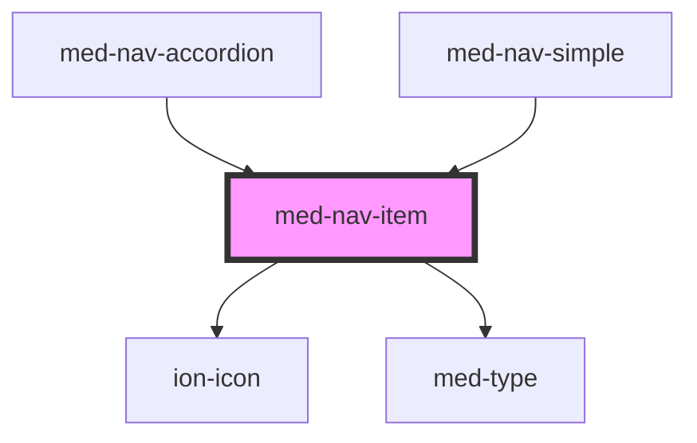

# med-nav-item

<!-- Auto Generated Below -->

## Properties

| Property          | Attribute          | Description                             | Type                                                    | Default     |
| ----------------- | ------------------ | --------------------------------------- | ------------------------------------------------------- | ----------- |
| `active`          | `active`           | Define o estado active do componente.   | `boolean`                                               | `false`     |
| `disabled`        | `disabled`         | Define o estado disabled do componente. | `boolean`                                               | `false`     |
| `dsColor`         | `ds-color`         | Define a cor do componente.             | `string \| undefined`                                   | `undefined` |
| `icon`            | `icon`             | Define o icone do componente.           | `string \| undefined`                                   | `undefined` |
| `iconOnly`        | `icon-only`        | TODO.                                   | `boolean`                                               | `false`     |
| `routerAnimation` | --                 | TODO.                                   | `((baseEl: any, opts?: any) => Animation) \| undefined` | `undefined` |
| `routerDirection` | `router-direction` | TODO.                                   | `"back" \| "forward" \| "root"`                         | `'forward'` |
| `text`            | `text`             | Define o texto do componente.           | `string \| undefined`                                   | `undefined` |

## Events

| Event      | Description | Type                |
| ---------- | ----------- | ------------------- |
| `medBlur`  | TODO.       | `CustomEvent<void>` |
| `medClick` | TODO.       | `CustomEvent<void>` |
| `medFocus` | TODO.       | `CustomEvent<void>` |

## Dependencies

### Used by

 - [med-nav-accordion](../../compositions/med-nav-accordion)
 - [med-nav-simple](../../compositions/med-nav-simple)

### Depends on

- ion-icon
- [med-type](../../foundation/med-type)

### Graph

----------------------------------------------

*Built with [StencilJS](https://stenciljs.com/)*
