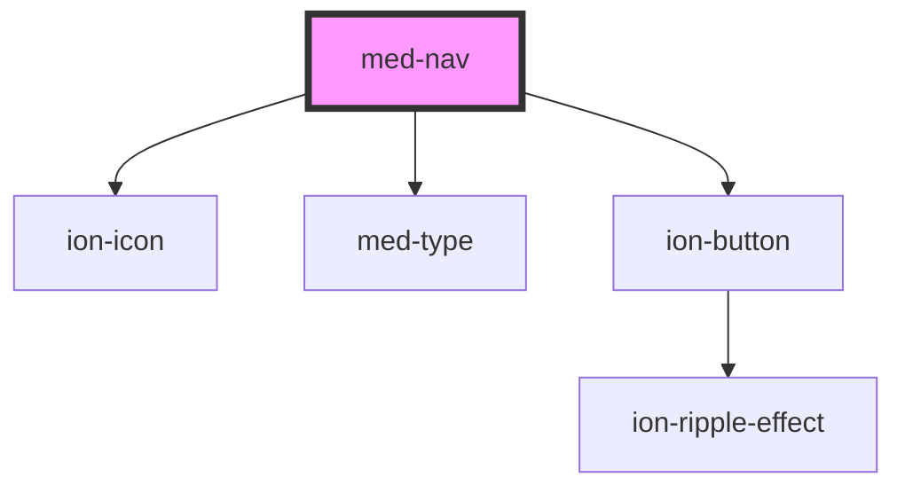

# med-nav

<!-- Auto Generated Below -->

## Properties

| Property  | Attribute  | Description                 | Type                  | Default     |
| --------- | ---------- | --------------------------- | --------------------- | ----------- |
| `dsColor` | `ds-color` | Define a cor do componente. | `string \| undefined` | `undefined` |

## Dependencies

### Depends on

- ion-icon
- [med-type](../med-type)
- [ion-button](../../../button)

### Graph

----------------------------------------------

*Built with [StencilJS](https://stenciljs.com/)*
