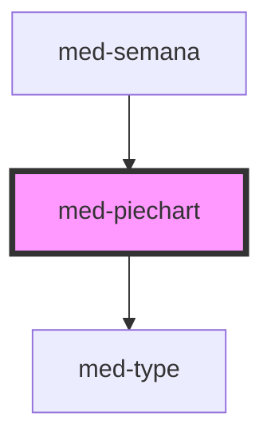

# med-piechart

<!-- Auto Generated Below -->

## Properties

| Property  | Attribute  | Description                    | Type                  | Default     |
| --------- | ---------- | ------------------------------ | --------------------- | ----------- |
| `active`  | `active`   | Define o estado do componente. | `boolean`             | `false`     |
| `dsColor` | `ds-color` | Define a cor do componente.    | `string \| undefined` | `undefined` |
| `text`    | `text`     | Define o texto do componente.  | `string \| undefined` | `undefined` |
| `value`   | `value`    | Define o value do componente.  | `number`              | `0`         |

## Methods

### `toggle(event?: Event | undefined) => Promise<void>`

#### Returns

Type: `Promise<void>`

## Dependencies

### Used by

 - [med-semana](../../compositions/med-semana)

### Depends on

- [med-type](../med-type)

### Graph

----------------------------------------------

*Built with [StencilJS](https://stenciljs.com/)*
