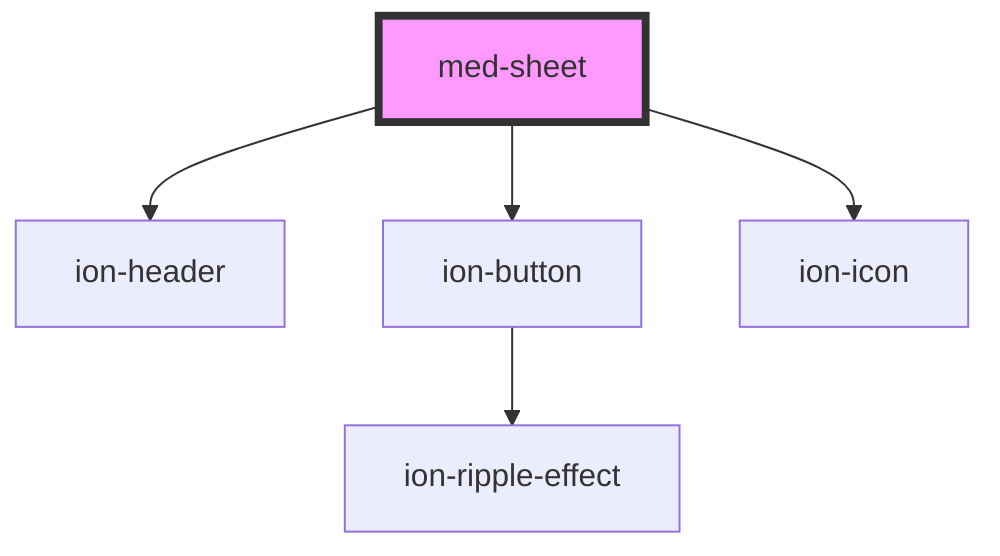

# med-sheet

<!-- Auto Generated Below -->

## Events

| Event      | Description | Type               |
| ---------- | ----------- | ------------------ |
| `medClick` |             | `CustomEvent<any>` |

## Dependencies

### Depends on

- [ion-header](../../../header)
- [ion-button](../../../button)
- ion-icon

### Graph

----------------------------------------------

*Built with [StencilJS](https://stenciljs.com/)*
