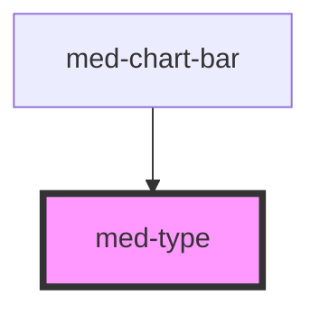

# med-type

<!-- Auto Generated Below -->

## Properties

| Property  | Attribute  | Description                   | Type                  | Default     |
| --------- | ---------- | ----------------------------- | --------------------- | ----------- |
| `dsColor` | `ds-color` | Define a cor do componente.   | `string \| undefined` | `undefined` |
| `token`   | `token`    | Define o token do componente. | `string \| undefined` | `undefined` |

## Dependencies

### Used by

 - [med-chart-bar](../med-chart-bar)

### Graph

----------------------------------------------

*Built with [StencilJS](https://stenciljs.com/)*
