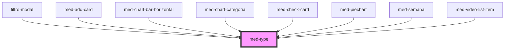

# med-type

<!-- Auto Generated Below -->

## Properties

| Property  | Attribute  | Description                      | Type                                                                         | Default     |
| --------- | ---------- | -------------------------------- | ---------------------------------------------------------------------------- | ----------- |
| `dsColor` | `ds-color` | Define a cor do componente.      | `string \| undefined`                                                        | `undefined` |
| `tag`     | `tag`      | Define a tag HTML do componente. | `"h1" \| "h2" \| "h3" \| "h4" \| "h5" \| "h6" \| "p" \| "span" \| undefined` | `'span'`    |
| `token`   | `token`    | Define o token do componente.    | `string \| undefined`                                                        | `undefined` |

## Dependencies

### Used by

 - [filtro-modal](../../team/dashboard/filtro-modal)
 - [med-add-card](../../compositions/med-add-card)
 - [med-chart-bar-horizontal](../med-chart-bar-horizontal)
 - [med-chart-categoria](../../compositions/med-chart-categoria)
 - [med-check-card](../../compositions/med-check-card)
 - [med-piechart](../med-piechart)
 - [med-semana](../../compositions/med-semana)
 - [med-video-list-item](../../testes/med-video-list-item)

### Graph

----------------------------------------------

*Built with [StencilJS](https://stenciljs.com/)*
