# med-type

<!-- Auto Generated Below -->

## Properties

| Property  | Attribute  | Description                      | Type                                                                                    | Default     |
| --------- | ---------- | -------------------------------- | --------------------------------------------------------------------------------------- | ----------- |
| `dsColor` | `ds-color` | Define a cor do componente.      | `string \| undefined`                                                                   | `undefined` |
| `tag`     | `tag`      | Define a tag HTML do componente. | `"h1" \| "h2" \| "h3" \| "h4" \| "h5" \| "h6" \| "label" \| "p" \| "span" \| undefined` | `'span'`    |
| `token`   | `token`    | Define o token do componente.    | `string \| undefined`                                                                   | `undefined` |

## Dependencies

### Used by

 - [filtro-modal](../../team/dashboard/filtro-modal)
 - [med-add-card](../../compositions/med-add-card)
 - [med-aula-professor](../../compositions/med-aula-professor)
 - [med-banner](../med-banner)
 - [med-calendar](../med-calendar)
 - [med-calendar-day](../med-calendar-day)
 - [med-chart-bar-horizontal](../med-chart-bar-horizontal)
 - [med-chart-categoria](../../compositions/med-chart-categoria)
 - [med-chart-radial](../med-chart-radial)
 - [med-check-card](../../compositions/med-check-card)
 - [med-nav](../med-nav)
 - [med-nav-accordion](../med-nav-accordion)
 - [med-nav-item](../med-nav-item)
 - [med-piechart](../../compositions/med-piechart)
 - [med-rate-aula](../../global/med-rate-aula)
 - [med-semana](../../compositions/med-semana)
 - [med-video-list-item](../../testes/med-video-list-item)

### Graph

```mermaid
graph TD;
  filtro-modal --> med-type
  med-add-card --> med-type
  med-aula-professor --> med-type
  med-banner --> med-type
  med-calendar --> med-type
  med-calendar-day --> med-type
  med-chart-bar-horizontal --> med-type
  med-chart-categoria --> med-type
  med-chart-radial --> med-type
  med-check-card --> med-type
  med-nav --> med-type
  med-nav-accordion --> med-type
  med-nav-item --> med-type
  med-piechart --> med-type
  med-rate-aula --> med-type
  med-semana --> med-type
  med-video-list-item --> med-type
  style med-type fill:#f9f,stroke:#333,stroke-width:4px
```

----------------------------------------------

*Built with [StencilJS](https://stenciljs.com/)*
