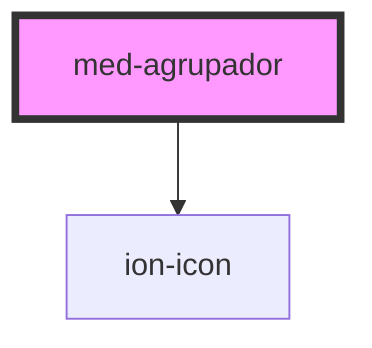

# med-agrupador

<!-- Auto Generated Below -->

## Properties

| Property    | Attribute   | Description                    | Type                  | Default              |
| ----------- | ----------- | ------------------------------ | --------------------- | -------------------- |
| `collapsed` | `collapsed` | Define o estado do componente. | `boolean`             | `false`              |
| `dsColor`   | `ds-color`  | Define a cor do componente.    | `string \| undefined` | `undefined`          |
| `texto1`    | `texto-1`   | TODO.                          | `string`              | ``Expandir a lista`` |
| `texto2`    | `texto-2`   | TODO.                          | `string`              | ``Ocultar a lista``  |

## Methods

### `toggle(event?: Event | undefined) => Promise<void>`

Define o estado do componente programaticamente.

#### Returns

Type: `Promise<void>`

## CSS Custom Properties

| Name      | Description                 |
| --------- | --------------------------- |
| `--color` | Define a cor do componente. |

## Dependencies

### Depends on

- ion-icon

### Graph

----------------------------------------------

*Built with [StencilJS](https://stenciljs.com/)*
