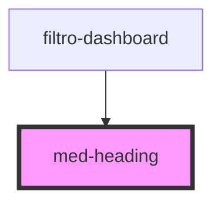

# med-heading

<!-- Auto Generated Below -->

## Properties

| Property  | Attribute  | Description                                 | Type                                                         | Default     |
| --------- | ---------- | ------------------------------------------- | ------------------------------------------------------------ | ----------- |
| `dsColor` | `ds-color` | Define a cor do componente.                 | `string \| undefined`                                        | `undefined` |
| `dsName`  | `ds-name`  | Define a variação do componente.            | `"high" \| undefined`                                        | `undefined` |
| `dsSize`  | `ds-size`  | Define a variação de tamanho do componente. | `"lg" \| "md" \| "sm" \| "xl" \| "xs" \| "xxs" \| undefined` | `undefined` |

## Dependencies

### Used by

 - [filtro-dashboard](../../team/dashboard/filtro-dashboard)

### Graph

----------------------------------------------

*Built with [StencilJS](https://stenciljs.com/)*
