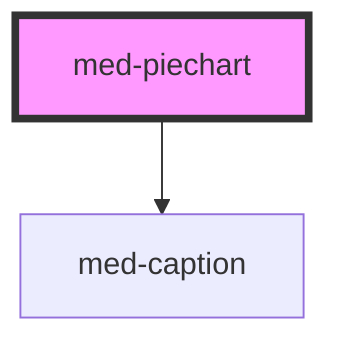

# med-piechart

<!-- Auto Generated Below -->

## Properties

| Property            | Attribute            | Description                                            | Type                  | Default     |
| ------------------- | -------------------- | ------------------------------------------------------ | --------------------- | ----------- |
| `active`            | `active`             | Define o estado do componente.                         | `boolean`             | `false`     |
| `downloadProgresso` | `download-progresso` | Define a porcentagem de download do botão de download. | `number`              | `0`         |
| `downloaded`        | `downloaded`         | Define o estado do componente.                         | `boolean`             | `false`     |
| `downloading`       | `downloading`        | Define o estado do componente.                         | `boolean`             | `false`     |
| `dsColor`           | `ds-color`           | Define a cor do componente.                            | `string \| undefined` | `undefined` |
| `progresso`         | `progresso`          | Define o progresso a ser mostrado.                     | `number`              | `0`         |

## Methods

### `toggle(event?: Event | undefined) => Promise<void>`

TODO

#### Returns

Type: `Promise<void>`

## Dependencies

### Depends on

- [med-caption](../med-caption)

### Graph

----------------------------------------------

*Built with [StencilJS](https://stenciljs.com/)*
