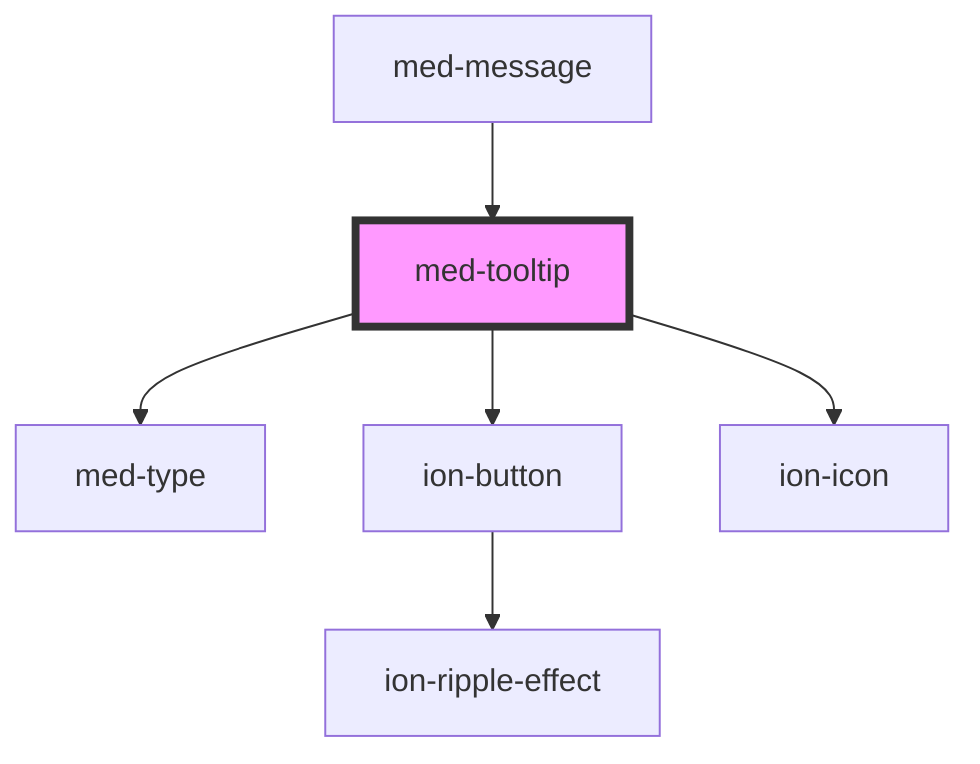

# med-context-menu

<!-- Auto Generated Below -->

## Properties

| Property    | Attribute   | Description                                   | Type                                                  | Default     |
| ----------- | ----------- | --------------------------------------------- | ----------------------------------------------------- | ----------- |
| `btnLeft`   | `btn-left`  | Define o texto do botão esquerdo, se existir. | `string \| undefined`                                 | `undefined` |
| `btnRight`  | `btn-right` | Define o texto do botão direito, se existir.  | `string \| undefined`                                 | `undefined` |
| `collapsed` | `collapsed` | TODO                                          | `boolean`                                             | `true`      |
| `content`   | `content`   | TODO                                          | `string \| undefined`                                 | `undefined` |
| `dsColor`   | `ds-color`  | TODO                                          | `string \| undefined`                                 | `undefined` |
| `placement` | `placement` | TODO                                          | `"bottom" \| "left" \| "right" \| "top" \| undefined` | `undefined` |
| `position`  | `position`  | TODO                                          | `"center" \| "end" \| "start" \| undefined`           | `undefined` |
| `titulo`    | `titulo`    | TODO                                          | `string \| undefined`                                 | `undefined` |

## Events

| Event           | Description | Type                |
| --------------- | ----------- | ------------------- |
| `btnLeftClick`  | TODO        | `CustomEvent<void>` |
| `btnRightClick` | TODO        | `CustomEvent<void>` |

## Methods

### `toggle(event?: any) => Promise<void>`

Define o estado do componente programaticamente.

#### Returns

Type: `Promise<void>`

## Dependencies

### Used by

 - [med-message](../med-message)

### Depends on

- [med-type](../../core/med-type)
- [ion-button](../../../button)
- ion-icon

### Graph

----------------------------------------------

*Built with [StencilJS](https://stenciljs.com/)*
