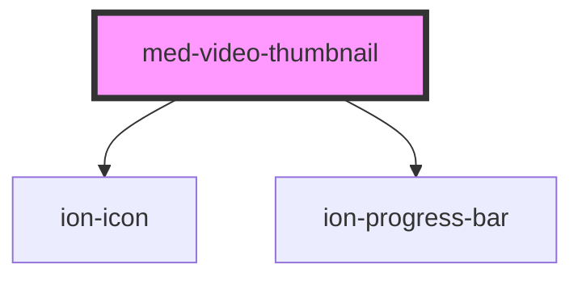

# med-video-thumbnail

<!-- Auto Generated Below -->

## Properties

| Property  | Attribute  | Description                                   | Type                  | Default     |
| --------- | ---------- | --------------------------------------------- | --------------------- | ----------- |
| `dsColor` | `ds-color` | Define a cor do componente.                   | `string \| undefined` | `undefined` |
| `url`     | `url`      | Define a url do componente.                   | `string \| undefined` | `undefined` |
| `value`   | `value`    | Define o valor da progress bar do componente. | `number`              | `0`         |

## Dependencies

### Depends on

- ion-icon
- [ion-progress-bar](../../progress-bar)

### Graph

----------------------------------------------

*Built with [StencilJS](https://stenciljs.com/)*
