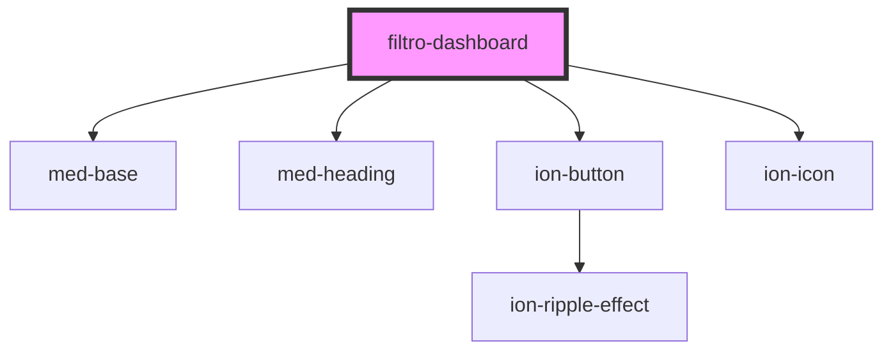

# filtro-dashboard

<!-- Auto Generated Below -->

## Dependencies

### Depends on

- [med-base](../../../global/med-base)
- [med-heading](../../../global/med-heading)
- [ion-button](../../../../button)
- ion-icon

### Graph

----------------------------------------------

*Built with [StencilJS](https://stenciljs.com/)*
