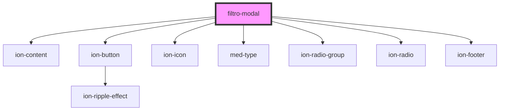

# filtro-modal

<!-- Auto Generated Below -->

## Dependencies

### Depends on

- [ion-content](../../../../content)
- [ion-button](../../../../button)
- ion-icon
- [med-type](../../../core/med-type)
- [ion-radio-group](../../../../radio-group)
- [ion-radio](../../../../radio)
- [ion-footer](../../../../footer)

### Graph

----------------------------------------------

*Built with [StencilJS](https://stenciljs.com/)*
