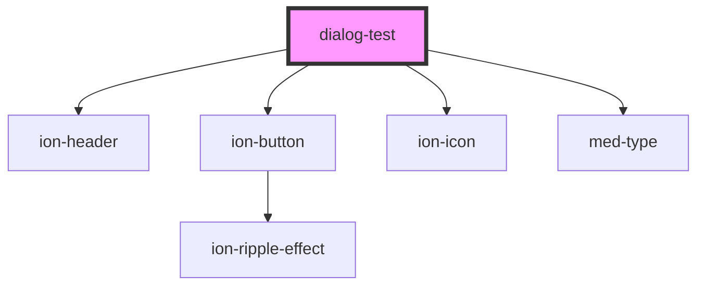

# dialog-test

<!-- Auto Generated Below -->

## Dependencies

### Depends on

- [ion-header](../../../header)
- [ion-button](../../../button)
- ion-icon
- [med-type](../../../@templarios/core/med-type)

### Graph

----------------------------------------------

*Built with [StencilJS](https://stenciljs.com/)*
