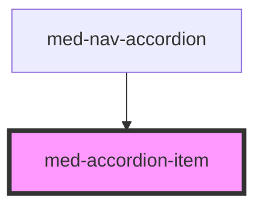

# accordion-item

<!-- Auto Generated Below -->

## Properties

| Property      | Attribute      | Description | Type                             | Default     |
| ------------- | -------------- | ----------- | -------------------------------- | ----------- |
| `background`  | `background`   | todo        | `boolean`                        | `false`     |
| `canCollapse` | `can-collapse` | todo        | `boolean`                        | `true`      |
| `dsColor`     | `ds-color`     | todo        | `string \| undefined`            | `undefined` |
| `isOpened`    | `is-opened`    | todo        | `boolean`                        | `false`     |
| `noBorder`    | `no-border`    | todo        | `boolean`                        | `false`     |
| `slotsToggle` | `slots-toggle` | todo        | `"end"[] \| "middle" \| "start"` | `[]`        |

## Events

| Event      | Description | Type               |
| ---------- | ----------- | ------------------ |
| `medClick` | todo        | `CustomEvent<any>` |
| `opened`   | todo        | `CustomEvent<any>` |
| `toggle`   | todo        | `CustomEvent<any>` |

## Slots

| Slot         | Description                                                         |
| ------------ | ------------------------------------------------------------------- |
| `"auxiliar"` | Define o conteúdo auxiliar do componente.                           |
| `"button"`   | Se houver botões no componente eles devem ser inseridos nesse slot. |
| `"content"`  | Define o conteúdo do componente.                                    |
| `"header"`   | Define o conteúdo do header do componente.                          |
| `"progress"` | Slot destinado a progress-bar.                                      |

## Dependencies

### Used by

 - [med-nav-accordion](../med-nav-accordion)

### Graph

----------------------------------------------

*Built with [StencilJS](https://stenciljs.com/)*
