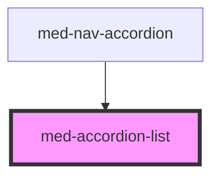

# hv-accordion

<!-- Auto Generated Below -->

## Properties

| Property      | Attribute      | Description | Type                                        | Default     |
| ------------- | -------------- | ----------- | ------------------------------------------- | ----------- |
| `margin`      | `margin`       | todo        | `"lg" \| "md" \| "sm" \| "xs" \| undefined` | `undefined` |
| `noAnimation` | `no-animation` | todo        | `boolean`                                   | `false`     |
| `noBorder`    | `no-border`    | todo        | `boolean`                                   | `false`     |
| `singleOpen`  | `single-open`  | todo        | `boolean`                                   | `true`      |

## Slots

| Slot | Description                                               |
| ---- | --------------------------------------------------------- |
|      | Slot default destinado ao componente `med-accordion-item` |

## Dependencies

### Used by

 - [med-nav-accordion](../med-nav-accordion)

### Graph

----------------------------------------------

*Built with [StencilJS](https://stenciljs.com/)*
